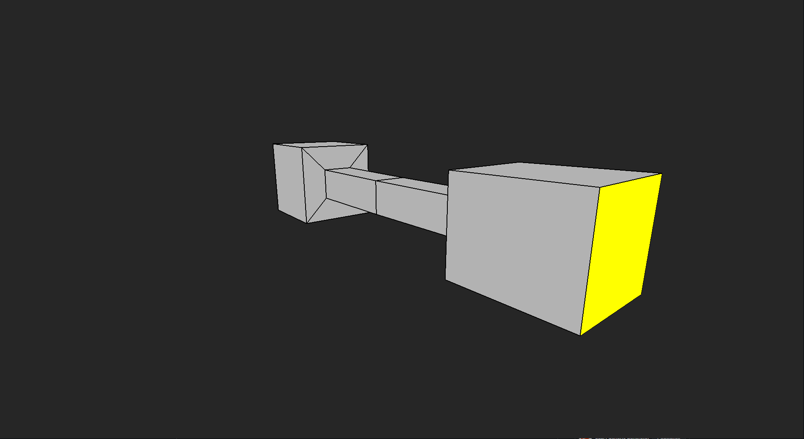
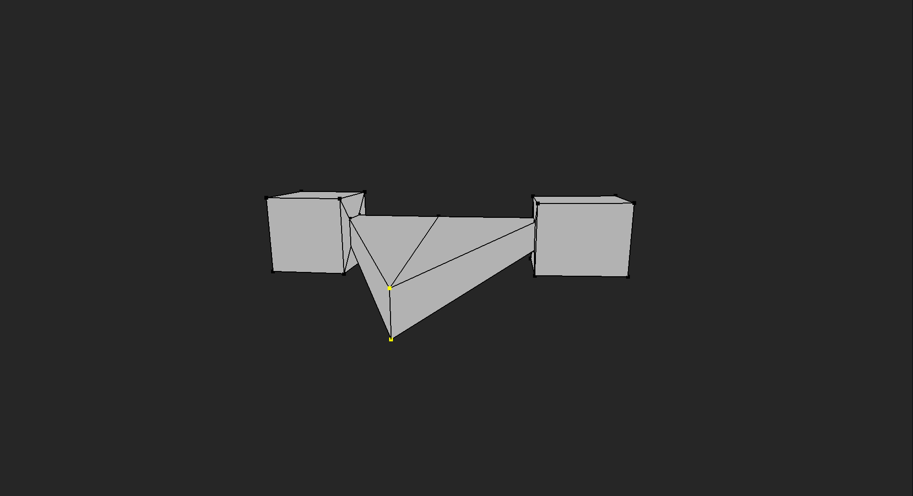
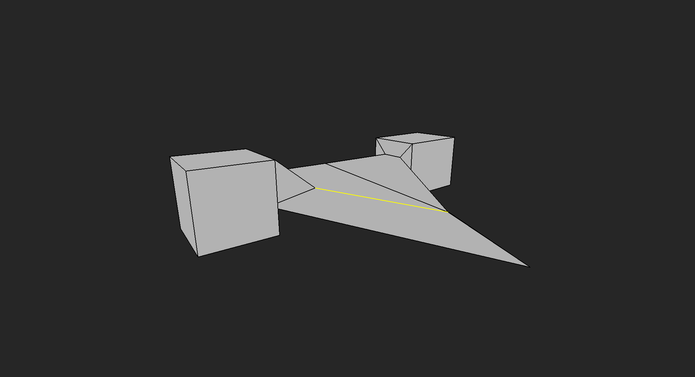

# 3D Modeling Software

A 3D modeling application built from scratch in C++ and OpenGL.

This project explores the systems behind modern 3D modeling software by implementing the underlying geometry, rendering, interaction, and editing tools directly rather than relying on an existing game engine or modeling framework.

The application is currently under active development.

## Features

* Real-time 3D rendering with OpenGL
* Orbit, pan, and zoom camera controls
* Vertex, edge, and face selection
* Ray-based object and geometry picking
* Editable polygon mesh topology
* Vertex and edge manipulation
* Face extrusion
* Polygon triangulation for rendering
* Multiple mesh/object support
* Object transformations
* Interactive modeling tools

## Technology

* **C++20**
* **OpenGL**
* **GLSL**
* **GLAD**
* **Win32 API**
* **CMake**

The application uses a custom Win32 windowing and input system rather than an external framework.

## Mesh Architecture

The modeling system uses a custom half-edge mesh data structure to represent editable polygon geometry.

Mesh topology is represented using vertices, half-edges, and faces, allowing the application to efficiently traverse and modify relationships between connected geometry.

Elements are referenced using generational handles rather than raw pointers or permanent array indices. This allows deleted storage to be reused while helping detect references to invalid or previously deleted mesh elements.

The mesh system supports operations including:

* Vertex creation and duplication
* Edge and half-edge creation
* Edge pairing
* Face construction
* Topology traversal
* Face and edge deletion
* Edge splitting
* Face extrusion

## Rendering

Rendering is handled through a custom OpenGL renderer.

Meshes maintain GPU-side vertex and index buffers for rendering:

* Faces
* Edges
* Vertices

Faces are triangulated before being uploaded for rendering, allowing editable polygon faces to be represented independently from the triangle geometry required by OpenGL.

## Polygon Triangulation

Polygon faces are triangulated using a custom ear-clipping triangulation algorithm.

The triangulation system:

1. Determines the polygon normal
2. Projects the polygon into 2D by removing its dominant axis
3. Determines polygon winding
4. Identifies valid ears
5. Iteratively generates triangles

Triangulation results are cached and regenerated when affected geometry changes.

## Selection & Picking

The application supports independent selection modes for:

* Vertices
* Edges
* Faces

Mouse input is converted into a world-space ray using the active camera and viewport.

Custom intersection tests are then used to determine which mesh component is under the cursor, including point, edge, and triangle intersection testing.

When multiple objects or components are intersected, the closest valid result is selected.

## Camera & Input

The application includes a custom input and action system supporting:

* Mouse movement
* Mouse buttons
* Mouse wheel
* Keyboard input
* Camera orbit
* Camera pan
* Camera zoom
* Geometry selection
* Selection modifiers
* Modeling actions

Input events are translated into application-level actions so that platform input handling remains separated from modeling behavior.

## Project Structure

The project is divided into systems responsible for:

* Application and window management
* Input handling
* Scene management
* Camera controls
* Mesh topology
* Mesh editing
* Selection and picking
* OpenGL rendering
* GPU mesh data
* Mathematics and geometry utilities

This separation allows the modeling and mesh systems to remain largely independent from the rendering and platform layers.

## Project Goals

The long-term goal of this project is to develop a lightweight 3D modeling environment while gaining a deeper understanding of the systems used by modeling tools and game-development software.

Rather than treating geometry editing, rendering, picking, and mesh topology as black boxes, these systems are implemented directly in C++.

Future development will continue expanding the mesh-editing toolset, user interface, scene management, and modeling workflow.

## Status

**In active development.**

Some systems and modeling operations are incomplete or subject to significant changes as the underlying architecture continues to evolve.
